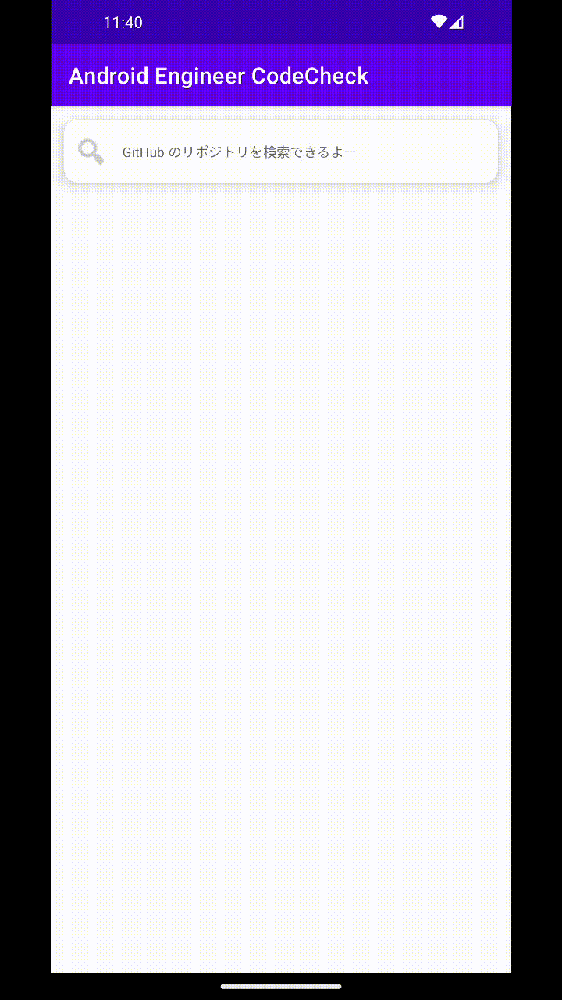

# 株式会社ゆめみ Android エンジニアコードチェック課題

## 概要

本プロジェクトは株式会社ゆめみ（以下弊社）が、弊社に Android エンジニアを希望する方に出す課題のベースプロジェクトです。本課題が与えられた方は、下記の概要を詳しく読んだ上で課題を取り組んでください。

## アプリ仕様

本アプリは GitHub のリポジトリを検索するアプリです。

### 環境

- IDE：Android Studio Flamingo | 2022.2.1 Patch 2
- Kotlin：1.8.22
- Java：17
- Gradle：8.1.1
- minSdk：23
- targetSdk：34

※ ライブラリの利用はオープンソースのものに限ります。
※ 環境は適宜更新してください。

### 開発環境構築

1. GitHubから `schema.json` をダウンロードし、`app/src/main/graphql` に配置してください。
   - `schema.json` の入手方法は以下の記事を参照してください。
   - [GitHub GraphQL のスキーマ情報を取得する｜まくろぐ](https://maku.blog/p/whv8it5/)
2. `jp.co.yumemi.android.codecheck.token.GitHubTokneProvider` を開き、自身のGitHubのトークンを入力してください。
   - この変更はコミットしないでください。 
   - `gradle.properties` を用いたトークンの管理は残課題としています。

### 動作

1. GitHubのアカウント名を入力（例：okuzawats）
2. GitHub API（`https://api.github.com/graphql`）で対象のアカウントのリポジトリを検索し、結果一覧を概要（リポジトリ名）で表示
3. 特定の結果を選択したら、該当リポジトリの詳細（リポジトリ概要、Fork 数、Star 数）を表示

## アーキテクチャ概要

### MVP

MVP（Model-View-Presenter）アーキテクチャを採用しています。また、画面間の結合を避けるために、画面遷移はNavigatorインターフェースを経由して行っています。

### Repository

リポジトリパターンを採用しています。各画面は、PresenterからUseCaseを呼び出し、UseCaseからRepositoryの処理を呼び出します。

### GraphQL

GitHubのGraphQL APIを用いてリポジトリの検索を行っています。GraphQLのクライアントとして、Apollo Kotlinを使用しています。

* [apollographql/apollo-kotlin: :robot:  A strongly-typed, caching GraphQL client for the JVM, Android, and Kotlin multiplatform.](https://github.com/apollographql/apollo-kotlin)

## 課題取り組み方法

Issues を確認した上、本プロジェクトを [**Duplicate** してください](https://help.github.com/en/github/creating-cloning-and-archiving-repositories/duplicating-a-repository)（Fork しないようにしてください。必要ならプライベートリポジトリにしても大丈夫です）。今後のコミットは全てご自身のリポジトリで行ってください。

コードチェックの課題 Issue は全て [`課題`](https://github.com/yumemi-inc/android-engineer-codecheck/milestone/1) Milestone がついており、難易度に応じて Label が [`初級`](https://github.com/yumemi-inc/android-engineer-codecheck/issues?q=is%3Aopen+is%3Aissue+label%3A初級+milestone%3A課題)、[`中級`](https://github.com/yumemi-inc/android-engineer-codecheck/issues?q=is%3Aopen+is%3Aissue+label%3A中級+milestone%3A課題+) と [`ボーナス`](https://github.com/yumemi-inc/android-engineer-codecheck/issues?q=is%3Aopen+is%3Aissue+label%3Aボーナス+milestone%3A課題+) に分けられています。課題の必須／選択は下記の表とします。

|   | 初級 | 中級 | ボーナス
|--:|:--:|:--:|:--:|
| 新卒／未経験者 | 必須 | 選択 | 選択 |
| 中途／経験者 | 必須 | 必須 | 選択 |

課題 Issueをご自身のリポジトリーにコピーするGitHub Actionsをご用意しております。  
[こちらのWorkflow](./.github/workflows/copy-issues.yml)を[手動でトリガーする](https://docs.github.com/ja/actions/managing-workflow-runs/manually-running-a-workflow)ことでコピーできますのでご活用下さい。

課題が完成したら、リポジトリのアドレスを教えてください。

## 参考記事

提出された課題の評価ポイントに関しては、[こちらの記事](https://qiita.com/blendthink/items/aa70b8b3106fb4e3555f)に詳しく書かれてありますので、ぜひご覧ください。

## AIサービスの利用について

ChatGPTなどAIサービスの利用は禁止しておりません。

利用にあたって工夫したプロンプトやソースコメント等をご提出頂くことで、加点評価する場合もございます。 (減点評価はありません)

また、弊社コードチェック担当者もAIサービスを利用させていただく場合があります。

AIサービスの利用は差し控えてもらいたいなどのご要望がある場合は、お気軽にお申し出ください。
